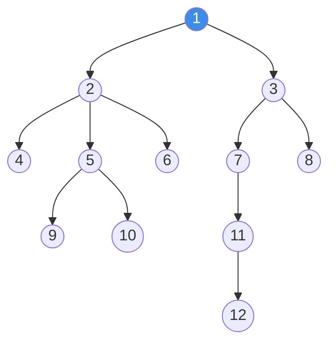
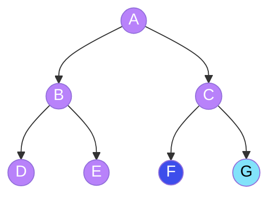
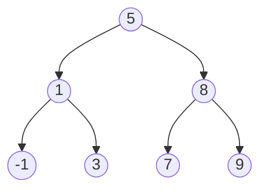

# Data Structure and Algorithms 
This repository contains solutions to various problems from [LeetCode](https://leetcode.com/) implemented in Python.
The primary goal of the repo is to:
* Track my progress and maintain a log of solved LeetCode problems.
* Serve as a resource for reviewing patterns and data structures.
* Practice writing clean, efficient, and well-documented Python code.

I strive to produce the best possible solution on my own. However, in cases where a problem requires a specific, more complex or not-enough clear pattern, the solution provided comes from others developer's solution. 
The following channels have been a huge guidance during this learning journey. A big thank you to them <3 and don't hesitate to visit them.
* [mycodeschool](https://www.youtube.com/@mycodeschool)
* [Abdul Bari](https://www.youtube.com/@abdul_bari)
* [Greg Hogg](https://www.youtube.com/@GregHogg)
* [NeetCode](https://www.youtube.com/@NeetCode)

Each file has a consistent structure for easy review. The files' header includes:
* Description of the approach used.
  * Some problems have more than one solution, thus address the follow-ups (such as space complexity constraints)
* Time Complexity and Space Complexity

## 🗺️ Learning Roadmap & Theory
*Click on a section to expand the theoretical notes and patterns.*

<details>
<summary>🌳 Trees</summary>
Trees are used to represent hierarchical data. Logical representation of data is always an inverted tree: root at top and branching out in downward direction.

There are three main concepts:
* **Node**: Is the basic unit of the structure; it contains data and may contain a link or references to other nodes.
* **Root**: Is the starting point of the tree:
    * It's the topmost node and the common ancestor of all other nodes.
    * A tree can only have one root.
    * All tree traversals must begin at the root.
* **Leaf**: The nodes located at the end of the branches:
    * Leafs do not have any children
    * They represents the end of a path within the structure.
* **Edge**: It is a pointer or reference to the memory address where other nodes are located.
    * An Edge always links a higher level with a lower level.
    * If a tree has N nodes, it will have N-1 edges
    
A representation of a Tree can be found in Figure 1. Considering that diagram and the key terms:
* Node (1) is the root of the tree.
* Nodes (4), (9), (10), (6), (8), (11) and (12) are leaves because they don't have any children.
* Node (1) is linked to nodes (2) and (3)
    * Nodes (2) and (3) are children of node (1), and they are called sibblings since they share the same parent.
    * In other words, if we can go from node (1) to node (2), (1) is ancestor of (2) or (2) is the descendant of (1).
* We can go from a parent to its children, but not from a child to its parent.

<p align="center"><i>Figure 1: Representation of a Tree.</i></p>

From the root node, the left and right children each form their own tree. These are called **subtrees**.

**A Tree is a structure that consists of a distinguished node called root linked to some sub-trees**

Once all the basic concepts have been covered, lets define other key terms:
* The **depth** of a node is the length of the path from root to that specific node. It answers the question: How far am I from the root?
    * The length is measured by the number of edges. Following the diagram in Figure 1, node (11) has a depth of 3.
    * The Root node always has a depth of 0.
    * **Level** is numerically equivalent to depth, but the first is a collective property that includes all nodes sharing the same depth. For a node *n* 
    ``` level(n) = depth(n) ```
        * Nodes (2) and (3) are at level 1
        * Nodes (4), (5), (6), (7) and (8) are at level 2
        * Nodes (9), (10), (11) are at level 3
        * Node (12) is at level 4

* The **height** of a node is measured by the number of edges in the longest path from that node to a leaf. It answers the question: How far am I from a leaf? 
    * The height of node (3) is 3 because there are 3 edges from (3) to (12).
    * The height of a leaf is always 0
    * The height of the tree is the height of the root node.


A subclass of trees is called a **Binary Tree** (for the sake of simplicy, it will be referred to as BT), in which each node can have at most 2 children. An example of a BT can be found in Figure 2, from which some additional definitions will ve derived:

* Full BT: Each node must have either zero or two children. The purple nodes in the diagram (Figure 2) represent a full BT.
* Complete BT: Every level is filled, with the possible exception of the last one. In the last level, all nodes must be placed as far left as possible. The purple nodes plus the blue node in Figure 2 is a complete BT.
* Perfect BT:Every internal node has two children, and all leaves are at the same level. It is shaped like a triangle with no gaps. The entire diagram in Figure 2 is a perfect BT.


<p align="center"><i>Figure 2: Subclasses of a  Binary Tree.</i></p>
A variant of a BT is the Binary Search Tree (BST). in this structure, for every node, all values in the left subtree are less or equal to the node's value, while all values of all in the right subtree are greater. An example of a BST can be found in Figure 3.



Some properties can be computed mathematically (these apply only when the root is considered level 0):
* Maximum numbers of nodes at level *i* is given by $ 2^{i} $
* The height *h* of a BT can be calculated based on the number of nodes *n* $$ h = \log_2(n+1)-1 $$
* The maximum number of nodes in a perfect tree with heigth *h* is given by $$ \text{max}_{\text{nodes}} = 2^{h+1}-1 \quad \text{or} \quad \text{max}_{\text{nodes}} = 2^{\text{\# of levels}}-1 $$
</details>