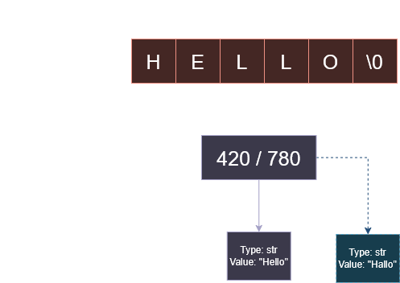

# Arrays
An array is a contiguous block of memory that stores a collection of elements. 
* **Statically Typed Languages (e.g., C):** All elements must share the same data type. The compiler reserves a specific amount of memory based on the type (int, char, float, etc.) and the number of elements. Because each element occupies a fixed-size slot, the system can calculate the exact memory address of any index.
```C
int arr[10] = {1,2,3,4,5,6,7,8,9,10}; //10 is the size of the array

```
* **Dynamic Languages (e.g., Python):** These do not store the literal data directly within the array's contiguous space. Instead, they store references (pointers) to objects located elsewhere in memory. This removes the limitation of uniform types, allowing a single array to contain integers, strings, or any other object.
```python
li = [1,"Hola", 123.976] #there is no need to specify the size of the array.
```
Refer to Figure 1 to check a graphic representation of memory allocation with these type of languages.

<p align="center">
  
  <br>
  <em>Figure 1: A representation of how different languages allocate arrays in memory.</em>
</p>

The easiest way of accessing a particular element in the array is through its index. For a given array of length 10 ```n = 10```, their indices go from 0 to 9 (```n-1```).
* ```arr[0] //1```
* ```li[1] #Hola```
* ```arr[9] //10```

An array is physically mutable, which means it can change its state or value without changing its memory address. For example, array's elements can be modofied through its index:

* arr[5] = 20 ->  {1,2,3,4,5,20,7,8,9,10}
* li[1] = 30 -> [1,30, 123.976]

Now number 20 is allocated in the same "box" where number 6 was before, the memory address remains the same despite a tha value has changed.

In both types of languages, a dynamic array is implemented using a static array as its foundation. Since memory blocks are fixed-size and contiguous, when the array reaches its full capacity, the system must:
* Allocate a new, larger block of memory (usually double the current size).    
* Copy all existing elements from the old array to the new one.
* Store the new value in the first available slot.
* Release (delete) the old memory block to avoid leaks.

This process allows the data structure to appear flexible to the programmer, even though it relies on rigid memory constraints.
> [!NOTE]
> In Python, when an array/list is defined, the Python Interpreter over-allocates memory by reserving extra space.
> * Typically, this "extra room" allows for appending elements on the fly without needing to request more memory from the OS every single time.
> * However, once the reserved memory block is completely full the interpreter perfomr the operation of dynamically allocating more space, so the developer does not need to worry about it.
>
> In C, these features are not managed by an interpreter. The developer is responsible for deciding if an array needs extra room and must manually manage dynamic memory using functions such as malloc(), calloc(), realloc(), and free(). This offers greater control and performance at the cost of manual responsibility for memory leaks and fragmentation.

### Array Operations and Limitations
* **Insert(x):** 
    * **Inserting** an element into a specific position takes **O(n)** time. This is because the operation requires shifting all subsequent elements one position to the right to make room for the new value. In fixed-size structures, the last value is lost to maintain the array's boundaries.
    * **Appending** an element to the end of an array (an append operation in Python) typically takes **O(1)** because it utilizes the pre-allocated extra space. However, if the reserved capacity is exceeded, the system must allocate a larger memory block and copy all existing elements, resulting in a worst-case time complexity of O(n).
* **Access(x):**
    * **Accessing** an element via its index takes O(1) time. This is because the memory address is calculated directly based on the index and the starting position of the array, allowing for immediate retrieval regardless of the array's size.
    * **Searching** for an element without knowing its index takes O(n) because, in the worst-case scenario, the entire array must be traversed to find it.
* **Deletion(x):**
    * **Deleting** an element from a specific position takes **O(n)** time. This is because the operation also requires shifting all the subsequent elements to the left to fill the empty slop. As a result, the empty slot is moved to the end of the array.
    * **Popping** an element from the end of an array takes **O(1)** time. Since no other elements need to be shifted to fill a empty slop, the operation simply involves removing the last item and updating the array's size.

# Strings
A string is essentially an array of characters. Depending on how the languague handles memory allocation, strings can be either **mutable** (as any other array's type) or **immutable**. Please refer to Figure 2.
* It is mutable when the string is stored as a block of characters. Since it behaves like a standard array, any element can be modified by accessing its index and overwriting the value directly in that memory address.
```c
char str[] = "Hello";
str[1] = 'a'; // The string in memory becomes "Hallo"
```
* It is unmutable when the variable acts as a reference (or label) pointing to the specific memory location where a string object is allocated. The system prevents modifying the existing object; instead, any "change" results in the variable pointing to a completely new string object in a different memory address.
    * Adding elements —even at the end of a string— takes O(n) time. Since the original object cannot be modified, the Python interpreter must allocate a completely new block of memory, copy the entire existing string, and then append the new character.
    * Removing any element in the string takes O(n) time. It follows the same "copy-and-create" process mentioned above
```python
s = "Hello" # 's' points to address 0x420 where "Hello" resides.
s = "Hallo" # 's' now points to a new address 0x780 where "Hallo" was created.
```
<p align="center">
  
  <br>
  <em>Figure 2: A representation of how C and Python allocate strings in memory.</em>
</p>

To conclude this topic, the following table compares the time complexity of various operations performed on the data structures covered in this guide. Given the scope of this guide, *Insert(x)* means append operation.

| **Operation** | **Unsorted array** | **String** | 
| :---- | :---   | :---  |
|*Search(x)*| **O(n)** | **O(n)** | 
|*Insert(x)*| **O(1)** | **O(n)** | 
|*Remove(x)*| **O(n)** | **O(n)** | 