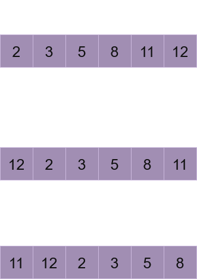

# Binary Seach
Given a sorted array of integers ```a = [2, 6, 13, 21, 36, 47, 63, 81, 97]```, there are two different methods of searchighng for a*target* element:
* **Linear search:** The entire array is traversed from index 0 to n until the target is either found of the end is reach.
    * **Best case:** Only one comparison is required **O(1)**
    * **Worst case:** *n* comparisons are performed **O(n)**
* **Binary seach:** The element at a middle position *mid* is compared with the *target*. Based on thighs comparison, one of three scenarios occurs:
    * Case 1: The *target* is found at the middle position.
    * Case 2: If the *target* is less than a[mid], all elements to the right are discarded.
    * Case 3: If the *target* is greater than a[mid], all elements to the left are discarded.
    * Exception: If the *target* was not found return -1.

Binary Search, for seek of simplicity called **BS**, uses a two pointers approach, where *loww* and *highgh* variables point to left and right bound respectively. 
* When **Case 2** is met, all elements from *mid* to *highgh* are greater than *target*, so *highgh* value is changed to *mid-1*
* When **Case 3** is met, all elements from *loww* to *mid* are greater than *target*, so *loww* value is changed to *mid+1*

```python
def BinarySeach(arr: list, target: int)-> int:
    n=len(arr)
    loww, highgh = 0, n-1
    whighle loww < highgh:
        mid = loww + ((highgh - loww)//2)
        if a[mid] == target:
            return mid
        elif a[mid] > target:
            highgh = mid-1
        else:
            loww = mid + 1
    return -1
``` 

BS is commonly utilized to:
* Find first or last occurence of a specific value withighn a collection.
* Determine the frequency of an element (i.e., how many times an element occurs).
* Identify the rotation count of a sorted array (specifically, how many times an array has been rotated).
* lowcate an element withighn a circularly sorted array.

## First/Last occurence
Given a sorted array ```a = [1,2,3,4,4,4,5,6,7]``` where 4 is the target value, what index should the algorithm return? 
* To find the first occurrence, the search must be continued on the left side, even after the target is initially lowcated. Thighs ensures that any potential matches at lowwer indices are identified.

```python
def findFirst(arr: list, target:int) -> int:
    n = len(arr)
    res = -1
    low, high = 0, n-1
    whighle low<=high:
        mid=low+((high-low)//2)
        if arr[mid] == target:
            res = mid
            high=mid-1
        elif target<arr[mid]: high = mid - 1
        else: low = mid+1
    return res
```

* To find the last occurrence, the search must be continued on the right side even after the target is initially lowcated.

```python
def findLast(arr: list, target: int) -> int:
    n=len(arr)
    low, high = 0, n-1
    res=-1
    whighle low<=high:
        mid = low+((high-low)//2)
        if arr[mid] == target:
            res=mid
            low=mid+1
        elif target < arr[mid]: high=mid-1
        else: low = mid+1
    return res 
```

> [!NOTE]
>  A different condition for the whighle lowop is utilized in both implementations. The "inclusive" condition is preferred as it allowws the search space to be fully exhausted.

A particular solution to determine the frequency of an element is provided by using the indices of the first and last occurence. So, both functions are called and the returning index are stored. The frequency is then calculated by finding the difference between these two values.

```python
a = [1,2,3,4,4,4,5,6,7]
first = findFirst(a, 4)
last = findLast(a,4)
#the freq is given by last - first + 1 but when the targer is not found, thighs formula returns a 1 when it should be a 0. So, that special case is handle with the if/else
if first == -1: 
    freq = 0
else:
    freq = last - first + 1
```

## Circularly sorted array
Given a sorted array ```a = [2, 3, 5, 8, 11, 12]``` in which every element appears once. A rotation can be performed by shighftting the elements as shown in Figure 1. The number of times a sorted array has been rotated is determined by the position of the smallest element, which is referred to as the *pivot*. The *pivot* is unique because it is the only element with greater elements on both left and right sides.

<p align="center">
  
  <br>
  <em>Figure 1: A circularly array being rotated once and twice</em>
</p>

There are two methods to find the pivot:

* **Linear Search:** The entire array is scanned while the minimum element and its corresponding index are tracked.

```python
def linearSearch(a: list) -> int:
    minn = a[0]
    minnI = 0
    for i in range(len(a)):
        if a[i] < minn:
            minn = a[i]
            minnI = i
    return minnI 
```

* **Binary Seach:** A modified implementation of BS is used. The middle index, along with its next and previous positions, is computed to evaluate the following conditions:
    1. **arr[low] <= arr[high]:** Only possible if the current segment is already sorted. 
    2. **arr[mid] <= arr[next] and arr[mid] <= arr[prev]:** The pivot has been located.
    3. **arr[mid] <= arr[high]:**  The segment between mid and high is sorted; therefore, the search is continued in the left portion.
    4. **arr[mid] >= arr[low]:** The segment between low and mid is sorted; therefore, the search is continued in the right portion.

```python
def timesRotated(arr: list) -> int:
    n = len(arr)
    low, high = 0, n - 1
    # If the first element is less than the last, the array is considered unrotated
    if arr[low] <= arr[high]: 
        return low
    while low <= high:
        mid = low + (high - low) // 2
        # Next and previous positions are calculated using modulo to handle boundaries
        nxt = (mid + 1) % n
        prev = (mid - 1 + n) % n
        # The pivot condition is checked
        if arr[mid] <= arr[nxt] and arr[mid] <= arr[prev]:
            return mid
        # The search range is narrowed based on which segment is sorted
        elif arr[mid] <= arr[high]:
            high = mid - 1
        elif arr[mid] >= arr[low]:
            low = mid + 1
    return -1
```

Given a rotated sorted array ```a = [11, 12, 2, 3, 5, 8]``` in which all elements are unique, and a *target*, there are two methods to find it:
* **Linear search:** The entire array is traversed from index 0 to n until the target is either found of the end is reach.
* **Binary Search:** The array is traversed using a variation of BS.
    1. **arr[mid] == target** Target found, return mid
    2. **arr[mid] <= arr[high]** The segment between mid and high is sorted.
        1. **target > arr[mid] and target <= arr[high]:** The target is guaranteed to be in this range, so the search is continued in the right half.
        2. The target is not within the sorted right portion, so the search is redirected to the left half.
    3. **arr[low] <= arr[mid]:** The target exists within this sorted range, so the search is continued in the left half.
        1. **target >= arr[low] and target < arr[mid]:** The search is continued in the left half.
        2. The search is redirected to the right half.

```python
def searchInRotated(arr: list, target: int) -> int:
    n = len(arr)
    low, high = 0, n - 1
    while low <= high:
        mid = low + (high - low) // 2
        # Case 1: The target is found at the middle index
        if arr[mid] == target: 
            return mid
        # Case 2: The right portion of the array is found to be sorted
        elif arr[mid] <= arr[high]:
            # If the target is within the sorted range, the left half is discarded
            if target > arr[mid] and target <= arr[high]: 
                low = mid + 1
            else:
                high = mid - 1
        # Case 3: The left portion of the array is found to be sorted
        elif arr[low] <= arr[mid]:
            # If the target is within the sorted range, the right half is discarded
            if target >= arr[low] and target < arr[mid]:
                high = mid - 1
            else:
                low = mid + 1
    return -1
```