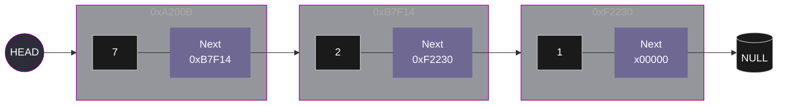

# Linked List
A **Linked List** is a linear data strcutrure in which elements are not allocated in a contiguous block of memory. Instead, each element is defines as an object or structure referred to as **Node**.
A **Node** is composed of two primary attributes:
* **Value:** The data is stored or referenced within the node; this can be an integer, string, or any other data type.
* **Next:** A reference or pointer to the memory address of the subsequent node.

```python
class Node:
    def __init__(self, value=0, next=None):
        self.value = value
        self.next = next
```

    
Two fundamental pointers are utilized to manage a Linked List:

* **Head:** This is a pointer that refers to the first element of the list. If the head pointer is lost or overwritten, the entire list becomes inaccessible from memory, resulting in a memory leak.
* **Tail:** This is identified as the final node in the sequence. To signify the end of the list, its Next attribute is set to ```NULL``` (in C) or ```None``` (in Python).



Several operations can be performed on a Linked List, including insertion, deletion, and reversal. To execute these, at least one auxiliary pointer (often referred to as *tmp* or current) is utilized. This pointer is initially set to the same address as the *head*. By using this temporary pointer, the list can be traversed without the original *head* reference being affected.

## Insertion

Typically, the insertion of a new element is performed at the end of the list. The process is handled based on the current state of the list:
1. **Initial State:** If the list is empty, the head pointer is set to ```None``` or ```NULL```.
2. **First Insertion:** When the first node is created, the *head* pointer is updated to point to this *new_node*. The Next attribute of this node is then set to ```None```.
3. **Subsequent Insertions:** If further elements are inserted, the list is traversed until the last node is reached. The Next pointer of the previously last node is updated to refer to the ```new_node```, while the Next attribute of the ```new_node``` is set to None.

<video src="https://github.com/user-attachments/assets/69b7c556-6524-4fa7-992f-8a309df3a7e0" controls autoplay muted width="400px">
  Tu navegador no admite el elemento de video.
</video>

```python
def insertNodeAtEnd(head: Node, value: int):
    new_node = createNode(value)
    tmp = head
    while tmp.next:
        tmp = tmp.next
    tmp.next = new_node
```

>[!NOTE]
> REMEMBER: If the head pointer is lost or overwritten, the entire list becomes inaccessible from memory, resulting in a memory leak.