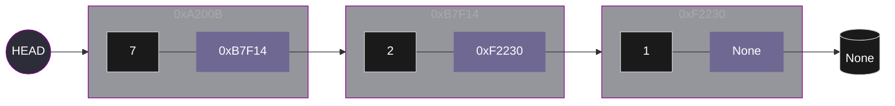

# Linked List
A **Linked List** is a linear data strcutrure in which elements are not allocated in a contiguous block of memory. Instead, each element is defines as an object or structure referred to as **Node**.
A **Node** is composed of two primary attributes:
* **Value:** The data is stored or referenced within the node; this can be an integer, string, or any other data type.
* **Next:** A reference or pointer to the memory address of the subsequent node.

```python
class Node:
    def __init__(self, value=0, next=None):
        self.value = value
        self.next = next
```

    
Two fundamental pointers are utilized to manage a Linked List:

* **Head:** This is a pointer that refers to the first element of the list. If the head pointer is lost or overwritten, the entire list becomes inaccessible from memory, resulting in a memory leak.
* **Tail:** This is identified as the final node in the sequence. To signify the end of the list, its Next attribute is set to ```NULL``` (in C) or ```None``` (in Python).



Several operations can be performed on a Linked List, including insertion, deletion, and reversal. To execute these, at least one auxiliary pointer (often referred to as *tmp* or current) is utilized. This pointer is initially set to the same address as the *head*. By using this temporary pointer, the list can be traversed without the original *head* reference being affected.

## Insertion and deletion

Typically, the insertion of a new element is performed at the end of the list. To insert an element at the end, the list must be completely traverse, which represents **O(n)** in time complexity. The process is handled based on the current state of the list:
1. **Initial State:** If the list is empty, the head pointer is set to ```None``` or ```NULL```.
2. **First Insertion:** When the first node is created, the *head* pointer is updated to point to this *new_node*. The Next attribute of this node is then set to ```None```.
3. **Subsequent Insertions:** If further elements are inserted, the list is traversed until the last node is reached. The Next pointer of the previously last node is updated to refer to the ```new_node```, while the Next attribute of the ```new_node``` is set to None.

```python
def insertNodeAtEnd(head: Node, value: int):
    new_node = createNode(value)
    tmp = head
    while tmp.next:
        tmp = tmp.next
    tmp.next = new_node
```

<video src="https://github.com/user-attachments/assets/69b7c556-6524-4fa7-992f-8a309df3a7e0" controls autoplay muted width="300px">
  Tu navegador no admite el elemento de video.
</video>

Insertion can also be performed at the head of the list. This process is considered more efficient because the need to traverse the entire structure is eliminated. It takes constant time **O(1)**. The process is executed as follows:
* The next attribute of the new_node is set to point to the current address stored in the head.
* The new_node is returned to the calling function or callback.
* The value of the head pointer is then updated to the memory address of the new_node.

```python
def insertNodeAtBeginning(head: Node, value: int) -> Node:
    new_node = createNode(value)
    new_node.next = head
    return new_node
```
<video src="https://github.com/user-attachments/assets/7272e083-2ced-44a3-ba53-c6ff5b210bd1" controls autoplay muted width="300px">
  Tu navegador no admite el elemento de video.
</video>

Insertion can be performed at any specific position within the list, utilizing either one-based or zero-based indexing. The process is executed as follows:
1. If the index is 1 for one-based indexing or the list is empty, the insertion is performed at the head.
2. The list is traversed using a temporary pointer *tmp* until the position immediately preceding the target index is reached.
3. The next attibute of the new node is set to point to the node currently occupying the target position, and the next attribute of the preciding node is then updated to point to the new node.

```python
def insertNodeAtIndex(head: Node, value: int, idx: int): #one-based indexing
    new_node = createNode(value)
    # If the index is 1, the new node is established as the new head
    if idx == 1 or head is None: 
        new_node.next = head
        return new_node
    tmp = head
    # The list is traversed until the (idx-1) position is reached
    # idx - 2 is utilized to stop at the node just before the target index
    for i in range(idx-2): 
        if tmp.next is not None:
            tmp=tmp.next
        else:
            break # If the index exceeds the list length, the node is inserted at the end
    new_node.next = tmp.next # The new node is linked to the subsequent part of the list 
    tmp.next = new_node # The preceding node is updated to point to the new node
    return head
```

<video src="https://github.com/user-attachments/assets/f76e7377-e7a5-4ac5-aacd-4a2a944a00ac" controls autoplay muted width="300px">
  Tu navegador no admite el elemento de video.
</video>

Deletion is performed following a similar pattern to insertion, where pointers must be carefully redirected to maintain the integrity of the list.
1. If the head is pointing to None, indicating an empty list, None is returned.
2. If the index is 1 for one-based indexing, the first element of the list must be removed. This is achieved by returning the address of the second element. 
3. To remove a node at a certain position, two pointers are utilized to manage the preceding and subsequent elements:
    * The list is traversed using a temporary pointer *tmp1* until the position immediately preceding the target index is reached.
    * Another temporary pointer *tmp2* is defined to point to the node that is intended for deletion.

```python
def deleteNode(head: Node, idx: int):
    if head is None:
        return None
    if idx == 1:
        return head.next
    tmp1 = head
    for i in range(idx-2):
        if tmp1.next is not None:
            tmp1=tmp1.next
        else:
            return head #target position out of bound, returns the original list 
    tmp2 = tmp1.next
    tmp1.next = tmp2.next
    return head
```

<video src="https://github.com/user-attachments/assets/f0ca7c38-6f1b-4010-9f51-2f9533eb739a" controls autoplay muted width="300px">
  Tu navegador no admite el elemento de video.
</video>

## Reverse a list

To reverse a linked list is necessary to maintain three reference simultaneously to ensure that the links are redirected properly. The following pointers are utilized during each iteration:
* The node that has already been processed, refer as *prev*
* The node that is currently being processed, refer as *curr*
* The node that will be processed in the following iteration, refer as *nxt*

And the process is executed through the following steps in a loop:
1. The address of the next node is stores in *nxt*.
2. The next attribute of *curr* node is reversed to point to prev.
3. The prev pointer now points to the *curr* node.
4. The *curr* pointer now points to the *nxt* node.

Once the end of the list is reached, the head is updated to point to the last node processed *prev*.

```python
def reverseRecursive(head: Node) -> Node:
    curr = head
    prev = None
    while curr is not None:
        nxt = curr.next
        curr.next = prev
        prev = curr
        curr = nxt
    return prev
```

<video src="https://github.com/user-attachments/assets/765ec385-7302-412d-a2d5-dfa9b2480f03" controls autoplay muted width="300px">
  Tu navegador no admite el elemento de video.
</video>

This operation can also be performed using recursion.

```python
def reverseRecursive(node: Node):
    if not node or not node.next:
        return node
    new_node = reverseRecursive(node.next)
    node.next.next = node
    node.next = None
    return new_node
```

>[!NOTE]
> REMEMBER: If the head pointer is lost or overwritten, the entire list becomes inaccessible from memory, resulting in a memory leak.