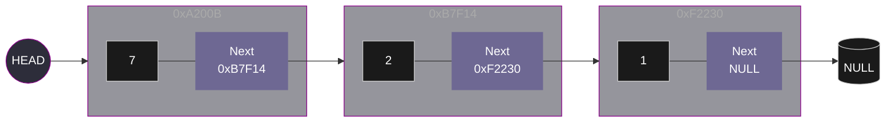

# Linked List
A **Linked List** is a linear data strcutrure in which elements are not allocated in a contiguous block of memory. Instead, each element is defines as an object or structure referred to as **Node**.
A **Node** is composed of two primary attributes:
* **Value:** The data is stored or referenced within the node; this can be an integer, string, or any other data type.
* **Next:** A reference or pointer to the memory address of the subsequent node.

```python
class Node:
    def __init__(self, value=0, next=None):
        self.value = value
        self.next = next
```

```c
struct node{
    int value;
    struct node* next_node;
};
```
    
Two fundamental pointers are utilized to manage a Linked List:

* **Head:** This is a pointer that refers to the first element of the list. If the head pointer is lost or overwritten, the entire list becomes inaccessible from memory, resulting in a memory leak.
* **Tail:** This is identified as the final node in the sequence. To signify the end of the list, its Next attribute is set to ```NULL``` (in C) or ```None``` (in Python).


