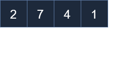
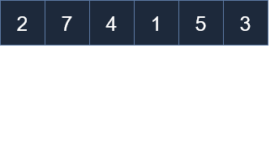
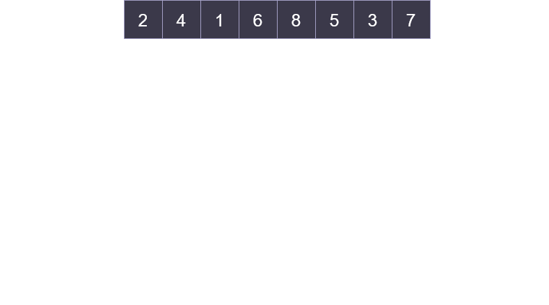
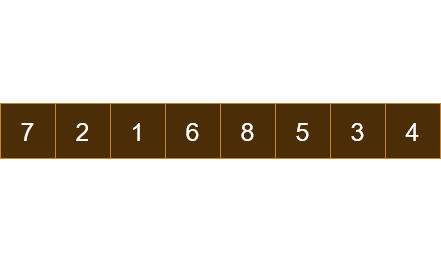

# Sorting algorithms
Searching in an **unsorted array** takes  **O(n)** times,he worst case, the algorithm must iterate through every element (Linear Search). In a sorted array, the same operation takes **O(log n)** using an Algorithm called [**Binary Search**](BinarySeach.md). This approach repeatedly divides the search interval in half, significantly reducing the number of comparisons.

A collection of elements can be arranged in a specific order, (e.g., numbers in ascending/descending order or strings in alophabetic order). Sorting algorithms are generally categorized by: 
* **Time Complexity**, the rate at which the time taken by an algorithm grows as the input size increases.
    * **Cuadratic O($n^2$)**: There are intuitive and easy to implement, but become significantly slower as the input increases. They are typically only recommended for small datasets or educational purposes.
        * Selection Sort
        * Bubble Sort
        * Insertion Sort
    * **Log-linear O($nlog(n)$)**: These utilize a Divide and Conquer strategy, often through recursion, to achieve much higher efficiency. They are the standard for production-level applications dealing with large amounts of data.
        * Merge Sort
        * Quick Sort
* **Space Complexity**, the amount of memory an algorithm uses relative to the input size.
* **Stability**, the ability to preserve the relative order of elements with equal values.

<p align="center">
  
  <br>
  <em>Figure 1: The Six of Clubs comes before the Six of Hearts, so the order is preserved.</em>
</p>

* **Internal/External** This classification refers to where the data resides during the sorting process, which directly affects access speed and the strategy used to handle the data.
    * **Internal Sorting (RAM):** occurs within the main memory. Common algorithms in this category include Bubble Sort, Insertion Sort, Quick Sort, and Heap Sort.
        * Operations are significantly faster because the processor can jump from the 0th to the 500th position almost instantly (Random Access).
        * The feasibility depends on the amount of free RAM compared to the dataset size.For example, trying to sort 64GB of data with 16 GB of RAM will cause a system failure.
    * **External Sorting (Disk/Tapes)** used when a the amount of data is too large to does fit into RAM. 
        * The data is divided into chunks that are small enough to be loaded into the RAM, where they are sorted using a internal sorting method. Each sorted chunk is then stored back in the external storage as a temporarly block.
        * Once all blocks are individually sorted, an External Merge Sort algorithm merges them together.

## Selection Sort
This algorithm works by repeatedly finding the minimum element from the unsorted part of the data. While the core logic remains the same, it can be implemented in two ways:
* Creating a new array in which all the elements will be copied in order. Given an array ```a = [2, 7, 4, 1]``` and an empty array ```b = []```, the algorithm is executed in a loop: 
    1. Search the minimum element in *a*
    2. Append that element in *b*
    3. Overwrite that element with a big enough value, to avoid picking it again. For example ```a[3] = float('inf')```
<p align="center">
  
  <br>
  <em>Figure 2: Selection sort with extra space.</em>
</p>

```python
def selectionSort(a: list[int]) -> list[int]:
    b = []
    n = len(a)
    for x in range(n): #iterate n times -> O(n)
        minn = float('inf')
        idx = 0
        for i, num in enumerate(a): #iterate n times -> O(n)
            if num < minn:
                minn = num
                idx = i
        b.append(minn)
        a[idx] = float('inf')
    return b
```

* Sorting the collection within the original memory block. It conceptually divides the array into a sorted and an unsorted section. Given an array ```a = [2, 7, 4, 1]``` which will be iterated using *i*: 
    * Search the array for the minimum value.
    * Swap that minimum value with the element at the i-th index.

<p align="center">
  
  <br>
  <em>Figure 3: Selection sort in-place.</em>
</p>

```python
def selectionSort(a: list[int]) -> None:
    n = len(a)
    for i in range(n):
        imin = i
        for j in range(i+1,n):
            if a[j] < a[imin]:
                imin=j
        a[i], a[imin] = a[imin], a[i]

```
### Complexity
Both implementations share the same time complexity, but they differ significantly in how they handle memory:
* **Time Complexity (O($n^2$)):** Both methods take quadratic time because the array is traversed entirely n times (where n is the number of elements). Even if the minimum is found in one step, the scanning must continue.
* **Space Complexity:**
    * Out-of-Place requires **O(n)** space because it allocates a new array of the same size as the original.
    * In-Place requires **O(1)** constant space because it reuses the original memory block and only needs a single temporaty variable for the swap.

## Bubble sort

Bubble sort is an iterative algorithm that "bubbles up" the largest elements to the end of the array by comparing and swapping adjacent neighbors.
* Compare element at i-th with i+1-th position.
* If element at i-th position is bigger, swap them.
    * If at least one swap occurs during a full pass, the array is not yet sorted; the process must repeat.
    * If the algorithm traverses the entire array without a single swap, it means the collection is already sorted, and the execution stops immediately.
* Through each iteration, the bigger elements is pushed to the end, so the range of iteration is reduces.
<p align="center">
  
  <br>
  <em>Figure 4: Bubble Sort.</em>
</p>

```python
def bubbleSort(a: list[int]):
    n = len(a)
    for k in range(n):
        flag = True
        for i in range(n-k-1):
            if a[i] > a[i+1]:
                a[i], a[i+1] = a[i+1], a[i]
                flag = False
        if flag:
            break
```
### Complexity
* **Time Complexity (O($n^2$)):** The array is traversed in a double-nested loop. Even though the inner loop gets shorter with each pass. In Big O analysis, as *n* tends to infinity, subtractions are ignored. 
* **Space Complexity (O(1)):** Since the sorting happens in-place by swapping adjacent elements within the original memory block, it requires constant space regardless of the input size.

## Insertion Sort

This algorithm divides the array into two subsets: a sorted and an unsorted part. Initially, The first element always belongs to the sorted set, while the rest resides in the unsorted part. 
* Pick an element *b* from the unsorted subset.
* Compare *b* with the previous value *a* in the sorted subset. Within a loop, the following instructions are executed until *b* reaches its proper position:
    * If *a* is greater than *b*, shift *b* one position to the right (overwriting *b*'s previous spot) to make room.
    * If *a* is smaller or equal than *b*, the correct position has been found, and the loop stops.
* Insert b into its final position. 

<p align="center">
  
  <br>
  <em>Figure 4: Insert Sort.</em>
</p>

```python
def insertionSort(a: list[int]):
    value = idx = 0
    n = len(a)
    for i in range(n):
        value, idx = a[i], i
        while idx > 0 and a[idx-1] > value:
            a[idx] = a[idx-1]
            idx-=1
        a[idx] = value 
```
### Complexity
* **Time Complexity (O($n^2$)):** The array is traversed in a double-nested loop. While the inner loop explores a growing sorted portion of the array in each pass, the total number of comparisons still follows a quadratic pattern (1 + 2 + 3 + ... + *n*).
* **Space Complexity (O(1)):** Since the sorting happens in-place by swapping elements within the original memory block, it requires constant space regardless of the input size.

## Merge Sort
Merge Sort is a **stable** algorithm based on a **Divide and Conquer** approach through recursion. The problem is divided into sub-problems until a base case is reached.
1. An array is repeatedly divided into halves ultil all elements are individually contained within their own arrays. By default, an array with just one element is considered sorted.
2. The individual arrays are merged together to form a larger array. Elements are compared during this process to ensure the resulting array is sorted.


<p align="center">
  
  <br>
  <em>Figure 5: Merge Sort.</em>
</p>

```python
def mergeSort(a: list[int]) -> list[int]:
    n = len(a) # The length of the array is retrieved
    # When the array contains only one element, the base case is met and the array is returned
    if n == 1: return a  
    mid = n//2 # The middle position of the array is computed
    # The left sub-array is formed from index 0 to mid, and the right from mid to the end. 
    # In the deepest call, elements are individually contained in resulting arrays.
    left, right = mergeSort(a[:mid]), mergeSort(a[mid:]) 
    sorted_arr = [0]*n
    r = l = i = 0 # Indices for the right, left, and sorted arrays are initialized
    # Main Loop: While indices l and r are within bounds, elements are compared and merged into sorted_arr
    while l < len(left) and r < len(right):
        if left[l] < right[r]: # If the element at the l-th position is smaller
            sorted_arr[i] = left[l]
            l+=1
        else: # If the element at the r-th position is smaller
            sorted_arr[i] = right[r]
            r+=1
        i+=1
    # When an index goes out of bounds, remaining elements in either array are verified. 
    # In such a scenario, these elements are appended to sorted_arr.
    while l < len(left):
        sorted_arr[i] = left[l]
        l+=1
        i+=1
    while r < len(right):
        sorted_arr[i] = right[r]
        r += 1
        i += 1
    return sorted_arr
```
### Complexity
* **Time Complexity (O($n\log_{2}(n)$)):** The algorithm itself is divided into two phases: 
    *  A **recursive division**, where the algorithm is called twice at each step with the input size being halved $T(n)$, $2T(n/2)$, $4T(n/4)$, $8T(n/8)$, ..., $2^kT(n/2^k)$. This process is repeated across *k* levels, where $2^k = n$ is satisfied. The depth of the recursion tree is given by $k = \log_{2}(n)$
    * After the recursive calls are returned, the resulting arrays are **merged**. At each level of the recursion tree, a total *n* elements are processed. This occurs with two halves, four quarters or $2^k$ subarrays of size $n/2^k$ are merged, always resulting in *n* operations per level.
* **Space Complexity O(n):** The sorting is not performed in-place. Instead, extra arrays are created so that elements can be placed in their sorted order.

## Quick Sort
Quick Sort is an recursive algorithm based on **divide and conquer**. Unlike Merge Sort, an element of the array (typically the right-most) is selected as a **pivot** to build a partially sorted array, where smaller elements are positioned to its left and greater elements are placed to its right. This specific step is called **partitioning**. Within recursive calls, the following steps are performed:
1. Pick a pivot 
2. Partition the array 
3. Recursivelly call the function itself modifying the bounds

<p align="center">
  
  <br>
  <em>Figure 6: Quick Sort.</em>
</p>

```python
def partition(a: list[int], startIndex: int, endIndex: int):
    pivot = a[endIndex] #last element as pivot
    pIndex = startIndex
    #array is traversed within its bounds. If elements are smaller that the pivot, they are placed to the left according to pIndex value.
    for i in range(startIndex, endIndex): 
        if a[i] <= pivot:
            a[i], a[pIndex] = a[pIndex], a[i]
            pIndex += 1
    a[pIndex], a[endIndex] = a[endIndex], a[pIndex] #the pivot is placed in its respectively position.
    return pIndex
def quickSort(arr: list[int], startIndex: int, endIndex: int):
    if startIndex < endIndex:
        pi = partition(arr, startIndex, endIndex)
        quickSort(arr, startIndex, pi-1)
        quickSort(arr, pi+1, endIndex)

a = [7,2,1,6,8,5,3,4]
quickSort(a, 0, len(a)-1)
```
### Complexity
* **Time Complexity:** This algorithm has two different scenarios: an *average* where the time taken is **O($n\log_{2}(n)$)** and a *worst* case where the tame taken is **O($n^{2}$)** For the seek of understanding, the implementation will be divided into 2 phases: 
    * A **partition** step where the elements are partially sorted according to the bounds and the pivot. This takes on average **O(n)** where *n* is the input size.
    * Two **quick sort** functions calls with different bounds. Depending on the pivot chosen, is the time taken for the resursive calls:
        * A **balanced** pivot is which allows the partition to divide the array in halves or al least with similar lengths. For example a 4 rearanges the array into ```[2, 3, 1, 4, 6, 7, 5, 8]```. The time taken for quick sort calls will be **O(n/2)** and the total time taken is given by: $$T(n) = 2T(n/2) + n \implies O(n\log_{2}(n))$$ 

        * An **unbalanced** pivot only reduces the bounds by one, for example an 8 rearanges the arrray into  ```[7, 2, 1, 6, 5, 3, 4, 8]```, with the new bounds at 0 and 6. The time taken for quick soft calls will be **O(n-1)** and the total time taken is given by: $$T(n) = T(n-1) + n = T(n-2) + 2n = T(n-4) + 4n = \quad\ldots\quad = T(n-k) + kn$$ $$T(n) = T(1) + n^{2} \quad\forall\quad n-k = 1 \quad\implies\quad O(n^{2})$$

* **Space Complexity O(1):** The sorting is performed in-place. 
A solution to always ensure a good pivot is pick it randomly on each call.
# Roundup

The following table compares the time taken for each algorithm cover in this notes. 
| **Algorithm** | **Time Complexity** |
| :---- | :---   | 
|*Selection Sort*| **O($n^2$)** |
|*Bubble Sort*| **O($n^2$)** |
|*Insertion Sort*| **O($n^2$)** |
|*Merge Sort*| **O($n\log_{2}(n)$)** |
|*Insertion Sort*| **AVG: O($n\log_{2}(n)$) Worst: O($n^2$)** |

To conclude this topic, the following table compares the time complexity of various operations performed on the data structures covered so far. 

| **Operation** | **Unsorted array** | **String** | **Sorted array** |
| :---- | :---   | :---  |  :---  |
|*Search(x)*| **O(n)** | **O(n)** | **O(\log_{2}(n))** |
|*Insert(x)*| **O(1)** | **O(n)** | **O(n)** |
|*Remove(x)*| **O(n)** | **O(n)** | **O(n)** |