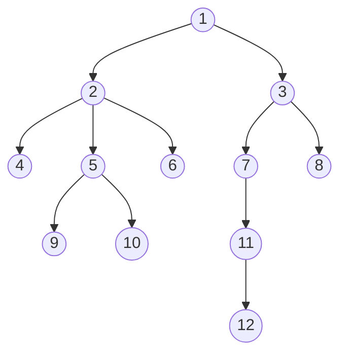
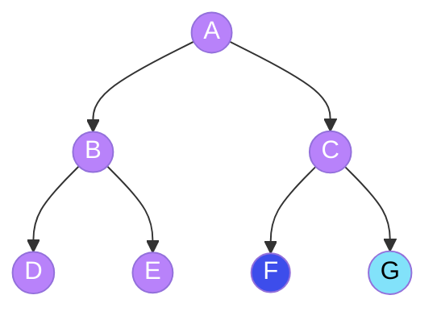
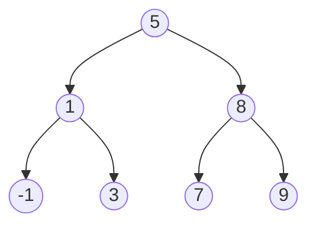
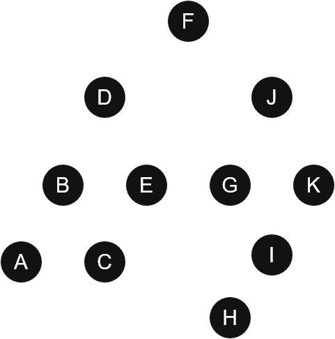

# Trees
Trees are used to represent hierarchical data. Logical representation of data is always an inverted tree: root at top and branching out in downward direction.

There are three main concepts:
* **Node**: Is the basic unit of the structure; it contains data and may contain a link or references to other nodes.
* **Root**: Is the starting point of the tree:
    * It is the topmost node and the common ancestor of all other nodes.
    * A tree can only have one root.
    * All tree traversals must begin at the root.
* **Leaf**: The nodes located at the end of the branches:
    * Leafs do not have any children
    * They represents the end of a path within the structure.
* **Edge**: It is a pointer or reference to the memory address where other nodes are located.
    * An Edge always links a higher level with a lower level.
    * If a tree has N nodes, it will have N-1 edges
    
A representation of a Tree can be found in Figure 1. Considering that diagram and the key terms:
* Node (1) is the root of the tree.
* Nodes (4), (9), (10), (6), (8), (11) and (12) are leaves because they don't have any children.
* Node (1) is linked to nodes (2) and (3)
    * Nodes (2) and (3) are children of node (1), and they are called sibblings since they share the same parent.
    * In other words, if we can go from node (1) to node (2), (1) is ancestor of (2) or (2) is the descendant of (1).
* We can go from a parent to its children, but not from a child to its parent.

<p align="center"><i>Figure 1: Representation of a Tree.</i></p>

From the root node, the left and right children each form their own tree. These are called **subtrees**.

**A Tree is a structure that consists of a distinguished node called root linked to some sub-trees**

Once all the basic concepts have been covered, lets define other key terms:
* The **depth** of a node is the length of the path from root to that specific node. It answers the question: How far am I from the root?
    * The length is measured by the number of edges. Following the diagram in Figure 1, node (11) has a depth of 3.
    * The Root node always has a depth of 0.
    * **Level** is numerically equivalent to depth, but the first is a collective property that includes all nodes sharing the same depth. For a node *n* 
    ``` level(n) = depth(n) ```
        * Nodes (2) and (3) are at level 1
        * Nodes (4), (5), (6), (7) and (8) are at level 2
        * Nodes (9), (10), (11) are at level 3
        * Node (12) is at level 4

* The **height** of a node is measured by the number of edges in the longest path from that node to a leaf. It answers the question: How far am I from a leaf? 
    * The height of node (3) is 3 because there are 3 edges from (3) to (12).
    * The height of a leaf is always 0
    * The height of the tree is the height of the root node.

A subclass of trees is called a **Binary Tree** (for the sake of simplicy, it will be referred to as BT), in which each node can have at most 2 children. An example of a BT can be found in Figure 2, from which some additional definitions will ve derived:

* Full BT: Each node must have either zero or two children. The purple nodes in the diagram (Figure 2) represent a full BT.
* Complete BT: Every level is filled, with the possible exception of the last one. In the last level, all nodes must be placed as far left as possible. The purple nodes plus the blue node in Figure 2 is a complete BT.
* Perfect BT:Every internal node has two children, and all leaves are at the same level. It is shaped like a triangle with no gaps. The entire diagram in Figure 2 is a perfect BT.


<p align="center"><i>Figure 2: Subclasses of a  Binary Tree.</i></p>
A variant of a BT is the Binary Search Tree (BST). in this structure, for every node, all values in the left subtree are less or equal to the node's value, while all values of all in the right subtree are greater. An example of a BST can be found in Figure 3.


<p align="center"><i>Figure 3: Representation of a Binary Search Tree.</i></p>

Some properties can be computed mathematically (these apply only when the root is considered level 0):
* Maximum numbers of nodes at level *i* is given by 
    $2^{i}$
* The height *h* of a BT can be calculated based on the number of nodes $n$: 
    $$h = \log_{2}(n+1)-1$$
* The maximum number of nodes in a perfect tree with heigth *h* is given by 
$$max_{nodes} = 2^{h+1}-1 \quad \text{or} \quad max_{nodes} = 2^{\text{number of levels}}-1$$

A BT can be implemented using:
* Arrays, where the position of an element determines its relationships:
    * With zero-based indexing: 
    $$\text{left-child idx} = 2i+1$$
    $$\text{right-child idx} = 2i+2$$
    * With one-based indexing:
    $$\text{left-child idx} = 2i$$
    $$\text{right-child idx} = 2i+1$$
```python
arr = [1, 2, 3, 4, 5, 6, 7]
'''
root -> 1
root's left-child -> 2
root's right-child -> 3
(2)'s left-child -> 4
(2)'s right-child -> 5
(3)'s left-child -> 6
(3)'s right-child -> 7
'''
```

* Dynamically created nodes, using a class:
```python
class TreeNode:
    def __init__(self, value=0, left=None, right=None):
        self.val = value
        self.left = left
        self.right=right
```
**All tree traversals must begin at the root**. There are two distinct traversing techniques:
* **Depth-First Search (DFS)** 
* **Breadth-First Search (BFS)**

These techniques are used to visit and **process** the nodes. 
**Note**: For this section, *process* is a generic term that can mean to print, edit or perform any operation on a node.

## Depth-First Search

As the name suggests, DFS prioritizes depth. Starting at the root, this technique tipically visit the left subtree before the right subtree. 


<p align="center"><i>Figure 4: DFS traversal on a Binary Tree. Orange indicates the node currently being visited, while blue represents backtracking to a previously visited node after its subtrees have been explored.</i></p>

DFS can be implemented either with stack or recursion.

### Iterative DFS using stack
This implementations takes advantage of several key properties of the **Stack**:
* **LIFO (Last-In, First-Out)**: This property forces the traversal to reach the deepest node before exploring neighbors at the same level.
* **Efficiency**: Both pushing and popping from the stack are performed in constant time, **O(1)**
The process begins by pushing the root onto the stack. The remainder of the algorithm consists of a loop in which the folowing operations are performed:
1. A pop operation is executed, and the resulting node is processed. 
2. If the node has a right child, it is pushed onto the stack. 
3. If the node has a left child, it is pushed onto the stack.

```python
def iterativeDFS(TreeNode: root) -> list[int]:
    stk = [root]
    res = []
    while stk: #while stk is not empty
        node = stk.pop()
        res.append(node.val)
        if node.right: stk.append(node.right)
        if node.left: stk.append(node.left)
    return res

'''
stk = [(F)] 
node = (F), it is processed
stk = [(J), (D)]
node = (D), it is processed
stk = [(J), (E), (B)]
node = (B), it is processed
stk = [(J), (E), (C), (A)]
node = (A), it is processed
node = (C), it is processed
node = (E), it is processed
node = (J), it is processed
stk = [(K), (G)]
node = (G), it is processed
stk = [(K), (I)]
node = (I), it is processed
stk = [(K), (H)]
node = (H), it is processed
node = (K), it is processed
res = [F, D, B, A, C, E, J, G, I , H, K]
'''
```

### DFS using recursion
This implementations leverages the power of recursion to navigate the tree structure:
* **Recursive calls**: The algorithm calls itself until a leaf node is reached.
* **Backtracking**: Once the left subtree has been fully processed, the function returns to the parent node to begin traversing the right subtree.

```python
def solution(root: TreeNode): -> list[int]
    res = [] 
    def dfs(node: TreeNode):
        if not node:
            return
        res.append(node.val)
        dfs(node.left)
        dfs(node.right)
    dfs(root)
    return res
#res = [F, D, B, A, C, E, J, G, I , H, K]
```

There are three different orders of processing:
* **Pre-order** *(Process myself -> Visit left -> Visit right)*: The current node is processed first. Then, the left subtree is visited, followed by the right subtree. 
    * Based on Figure 4, the result will be ```[F, D, B, A, C, E, J, G, I, H, K]```
    ```python
    def preOrder(node: TreeNode):
        if not node:
            return
        print(node)
        preOrder(node.left)
        preOrder(node.right)
    ```
* **In-order** *(Visit left -> Process myself -> Visit right)*: The left subtree is visited first. Once there are no more nodes to the left, the current node is processed, followed by the traversal of the right subtree. 
    * Based on Figure 4, the result will be ```[A, B, C, D, E, F, G, H, I, J, K]```
    ```python
    def inOrder(node: TreeNode):
        if not node:
            return
        inOrder(node.left)
        print(node)
        inOrder(node.right)
    ```
* **Post-order** *(Visit left -> Visit right -> Process myself)*: The left subtree is traversed first, followed by the right subtree. Only after there are no more nodes on either side, the current node is processed. 
    * Based on Figure 4, the result will be ```[A, C, B, E, D, H, I, G, K, J, F]```
    ```python
    def postOrder(node: TreeNode):
        if not node:
            return
        postOrder(node.left)
        postOrder(node.right)
        print(node) 
    ```
Complexity analysis is a vital part of understanding these algorithms. For a DFS, whether implemented recursively or iteratively:
* Time Complexity is **O(n)** because each node is visited exactly once. Regardless of whether the stack is managed manually or through the call stack, the pop and push operations are performed in constant time, **O(1)**.
* Space Complexity is **O(n)** in the worst case. On average space complexity is **O(h)** as the stack only needs to store at most *h* nodes or functions calls simultaneously, where *h* is the height of the tree. In worts scenario, *h* = *n*.  

## Breadth-Fisrt Search 
As the name suggests, BFS prioritizes breadth. Starting at the root node, all nodes at a given level are visited before moving to the next. Once the travelsal of L-0 is finished, L-1 is visited, followed by level 2, and so on.   


<p align="center"><i>Figure 5: BFS traversal on a Binary Tree. Orange indicates the node currently being visited.</i></p>

A BFS algorithm takes advantage of several key properties of the **Queue**:
* **FIFO (First-In, First-Out)**: This property forces to explore in a level order traversal.
* **Efficiency**: Both pushing and popping from the queue are performed in constant time, **O(1)**
The process begins by pushing the root onto the queue. The remainder of the algorithm consists of a loop in which the folowing operations are performed:
1. A pop operation is executed, and the resulting node is processed. 
2. If the node has a left child, it is pushed onto the stack. 
3. If the node has a right child, it is pushed onto the stack.
```python
from collections import deque
def BFS(node: TreeNode):
    q = deque()
    q.append(node)
    while q:
        node = q.popleft()
        print(node)
        if node.left: q.append(node.left)
        if node.right: q.append(node.right)
```
Complexity analysis is a vital part of understanding these algorithms. For a BFS:
* Time Complexity is **O(n)** because each node is visited exactly once, the pop and push operations are performed in constant time, **O(1)**.
* Space Complexity is **O(n)** in the worst case. The space complexity depends on the maximum width (*w*) of the tree, as the Queue needs to store all nodes of a single level simultaneously. In the worst-case scenario (a perfect binary tree), the width *w* is proportional to n (specifically *n*/2).  

To conclude this topic, the following table compares the time complexity of various operations performed on the data structures covered in this guide.

| **Operation** | **Unsorted array** | **Sorted array** | **Linked List** | **BT** | **BST** |
| :---- | :---   | :---     | :---- | :---   | :---     |
|*Search(x)*| **O(n)** | **O(logn)** | **O(n)** | **O(n)** | **O(logn)** |
|*Insert(x)*| **O(1)** | **O(n)** | **O(1)** at head or **O(n)** at tail | **O(n)** | **O(logn)** |
|*Remove(x)*| **O(n)** | **O(n)** | **O(n)** | **O(n)** | **O(logn)** |